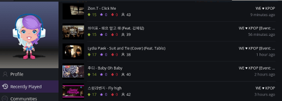

User Profiles
=============

ExtPlug plugin for accessing user profiles through the standard plug.dj UI. It
allows you to see users's profiles, play histories, and the public rooms they
host.

## Installation

You can install this plugin by going to your ExtPlug settings menu, pressing "Install Plugin",
and entering this Plugin URL:

```
https://unpkg.com/extplug-user-profiles
```

## Crash Course "User Profile Pages"

Clicking a username anywhere results in a popup like this:


Clicking a username in such a popup gets you into the Profile View for that
user with some common information.

[](./img/profile.png)

You can also check their play history and the public rooms that they host
straight from the standard UI.

[](./img/history.png)

## Building

**Note: this section is intended for developers only.**

First, install dependencies:

```bash
npm install
```

Then, use:

```bash
npm run build
```

The plugin will be built using the [ExtPlug CLI](https://github.com/extplug/extplug-cli).

The built plugin will be stored at `build/user-profiles.js`.

## License

[MIT](./LICENSE)
